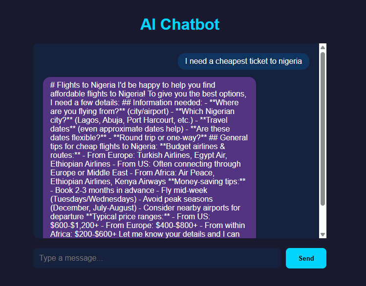
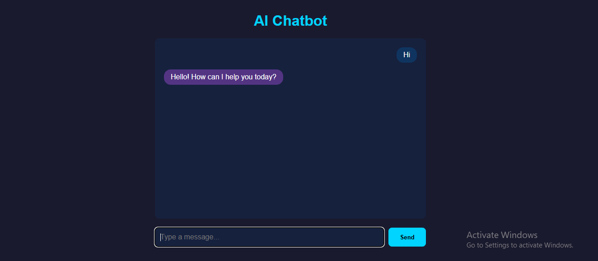

# 🤖 AI Chatbot - Python Project

A fully functional AI-powered chatbot built with Python and Claude AI.
Available as both a **web app** and **desktop app**.

## 🌐 Live Demo
👉 [Try it here](https://ai-chatbot-vepi.onrender.com)

## 📸 Screenshots

### Web App


### Desktop App


## ✨ Features
- 💬 Real-time AI responses powered by Claude AI
- 🌐 Web version accessible from any browser
- 🖥️ Desktop version runs on your computer
- 💰 Monthly Expense Tracker with file storage

## 🛠️ Tech Stack
- Python
- Flask (Web App)
- Tkinter (Desktop App)
- Anthropic Claude API
- Render (Deployment)

## 🚀 How to Run Locally

### Web App
```bash
cd chatbot-web
pip install -r requirements.txt
python app.py
```

### Desktop App
```bash
cd chatbot-desktop
python desktop_app.py
```

## 📁 Projects
| Project | Description |
|---|---|
| AI Chatbot Web App | Browser based AI chatbot |
| AI Chatbot Desktop | Desktop AI chatbot app |
| Expense Tracker | Monthly expense tracker |

## 👨‍💻 Author
**Ayind** - [GitHub](https://github.com/ayindeyusuf1999-max)